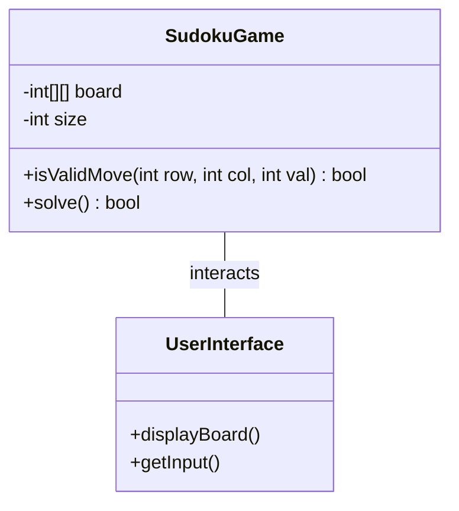
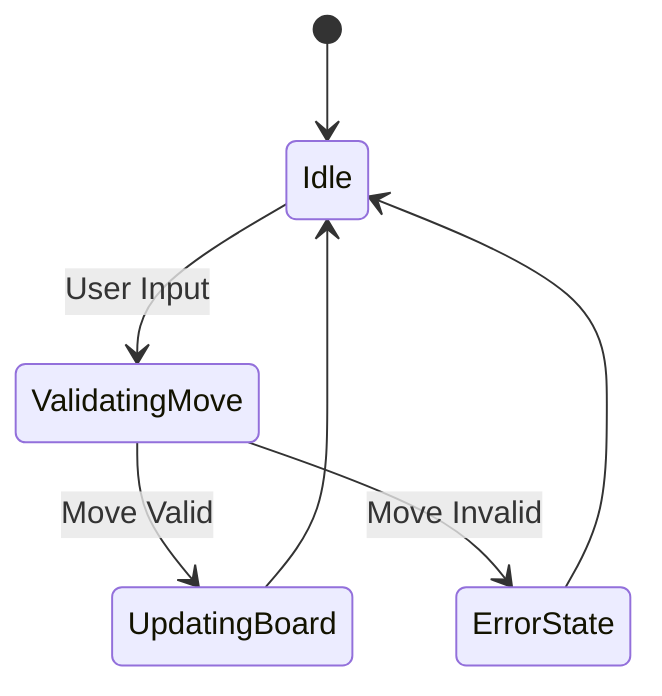

# 🎨 Plantilla de UML Vivo (Mermaid)

Este documento contiene los estándares para la documentación técnica viva (RA5, RA6). Copia estos bloques en tus archivos `.md` de documentación.

## 1. Diagrama de Clases (RA5.b)
*Refleja la estructura de tu Sudoku (Model, View, Controller).*

## 2. Diagrama de Comportamiento / Actividad (RA5.d)
*Refleja la lógica de validación de un movimiento.*

## 3. Guía de Evolución (Ingeniería Inversa)
> [!TIP]
> Cada vez que modifiques un método en Java, actualiza el diagrama correspondiente en el `.md`. Esto garantiza que la documentación sea "viva" y no un PDF estático muerto.
