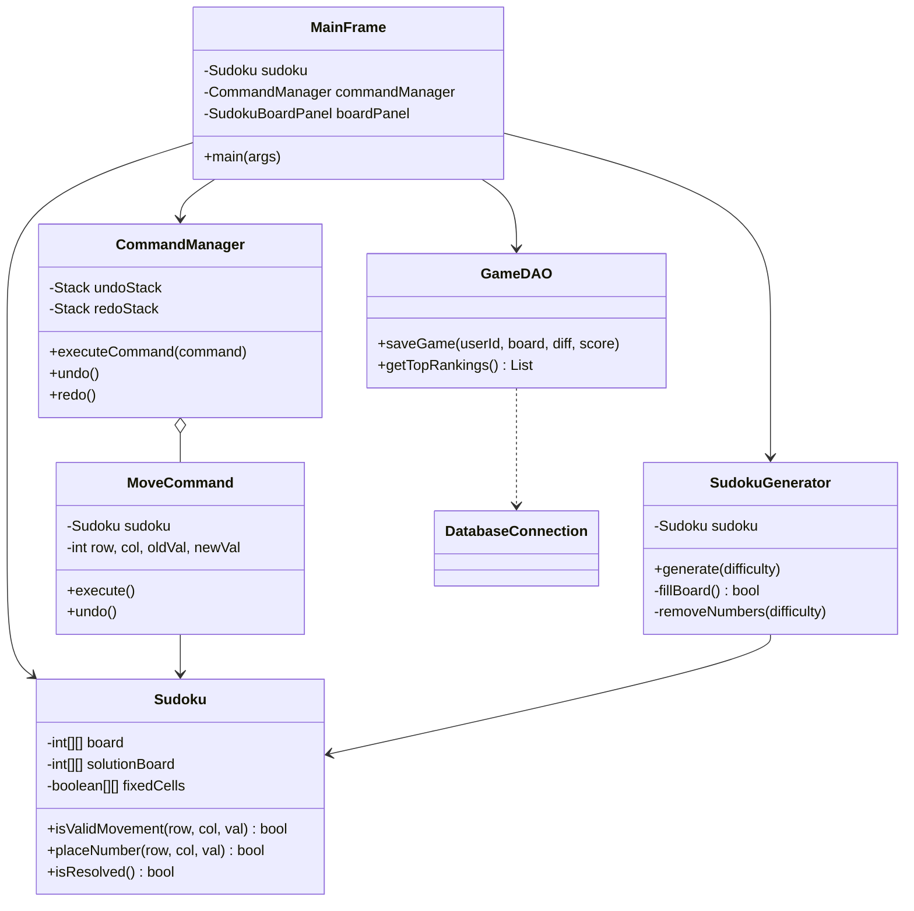
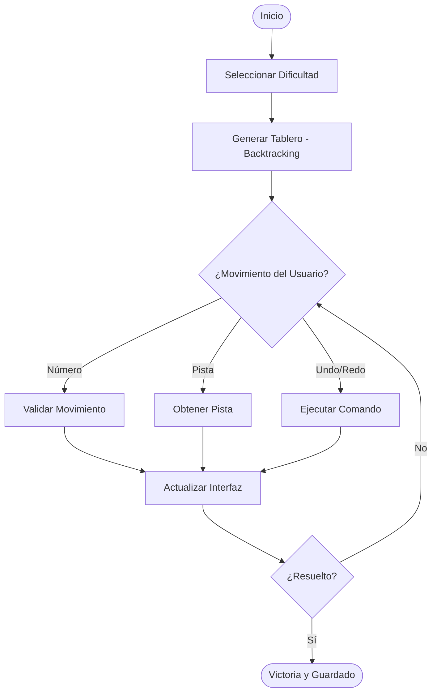
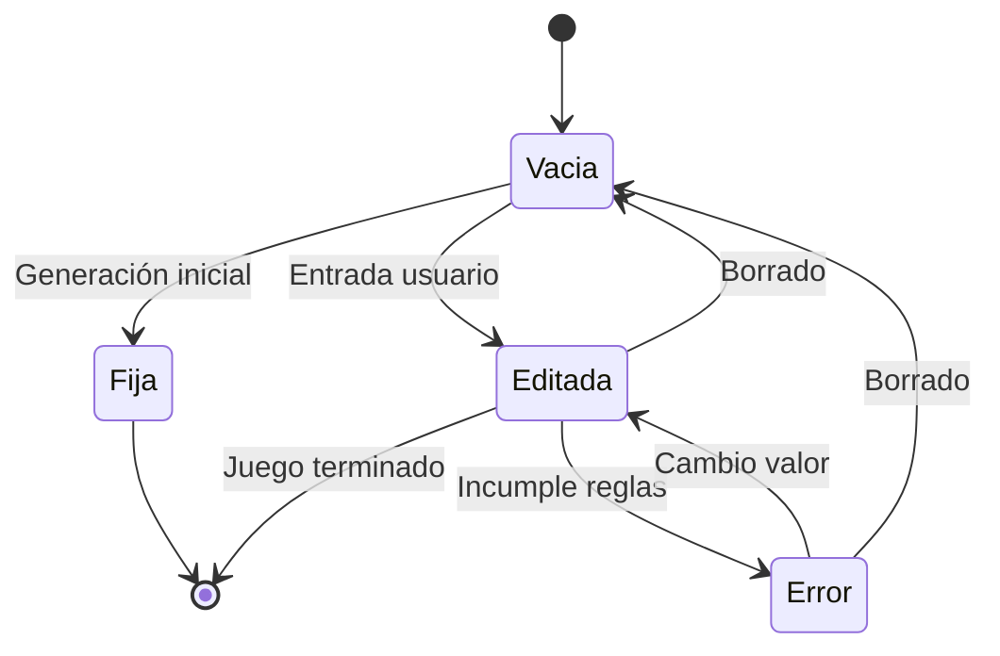

# 📊 Modelado UML y Diseño Visual (RA5, RA6)

Este documento contiene la representación visual de la arquitectura y el comportamiento del sistema Sudoku Elite mediante diagramas Mermaid.

## 1. Diagrama de Clases (Estructura)
Representa la jerarquía de clases y las relaciones entre componentes.

## 2. Diagrama de Actividad (Flujo de Juego)
Modela el proceso desde que el usuario inicia el programa hasta que resuelve el puzzle.

## 3. Diagrama de Estados (Celda de Sudoku)
Representa los estados posibles por los que pasa una celda durante la ejecución.

---
*Diagramas actualizados automáticamente reflejando la ingeniería inversa del código Java.*
