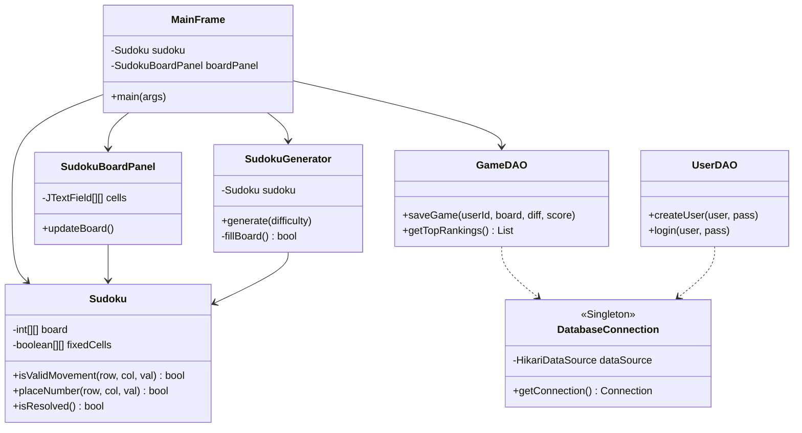

# Documentación Técnica - Sudoku Elite

Este documento detalla la arquitectura y las decisiones de diseño tomadas durante el desarrollo del proyecto Sudoku Elite.

## 🏛️ Arquitectura del Sistema

La aplicación sigue una estructura modular para separar la lógica de negocio de la interfaz de usuario y la persistencia de datos.

### 1. Diagrama de Clases
El siguiente diagrama muestra la relación entre las capas del sistema (Dominio, Persistencia y UI).

### 2. Lógica de Generación (Backtracking)
Para la generación de tableros, he implementado un algoritmo de **Backtracking**. El proceso es el siguiente:
1. Se limpia el tablero.
2. Se intenta rellenar cada celda con un número aleatorio del 1 al 9 que cumpla las reglas.
3. Si el algoritmo llega a un punto muerto, retrocede (backtrack) y prueba una opción diferente.
4. Finalmente, se eliminan números según la dificultad elegida para crear el puzzle.

### 3. Gestión de la Interfaz (Multi-hilo)
Debido a que la generación de tableros complejos puede tardar unos milisegundos, he utilizado **SwingWorker** para que el cálculo se realice en un hilo separado. Esto evita que la ventana se bloquee y permite mostrar un mensaje de carga al usuario.

### 4. Seguridad de Datos
Las contraseñas de los usuarios no se guardan en texto claro. He implementado una función de hash **SHA-256** en la capa DAO para asegurar que, incluso si la base de datos se viera comprometida, las credenciales originales estarían protegidas.

## 🛠️ Tecnologías Utilizadas
- **Java 17**: Lenguaje principal.
- **Maven**: Gestión de dependencias y construcción.
- **MySQL**: Base de datos relacional para usuarios y puntuaciones.
- **HikariCP**: Pool de conexiones para mejorar el rendimiento de la BD.
- **JUnit 5**: Pruebas unitarias para validar la lógica del motor.
