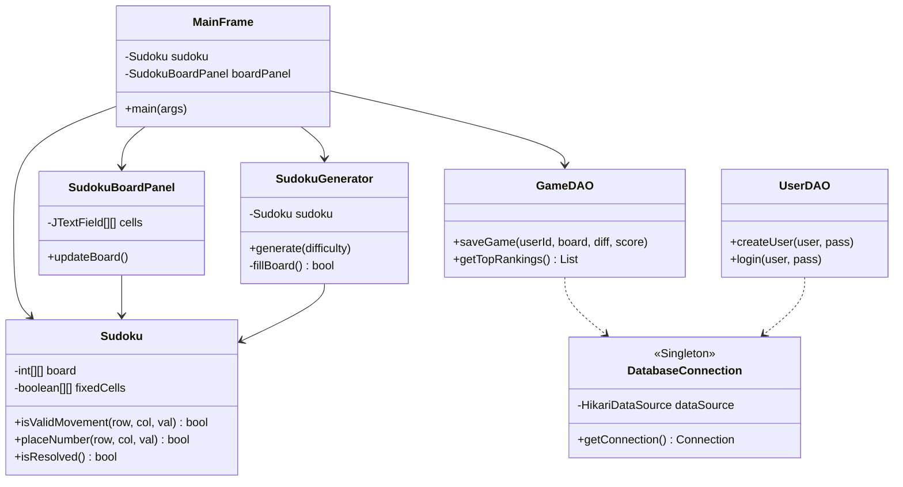
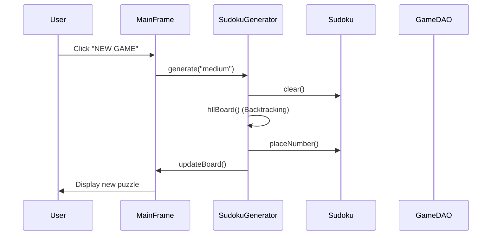
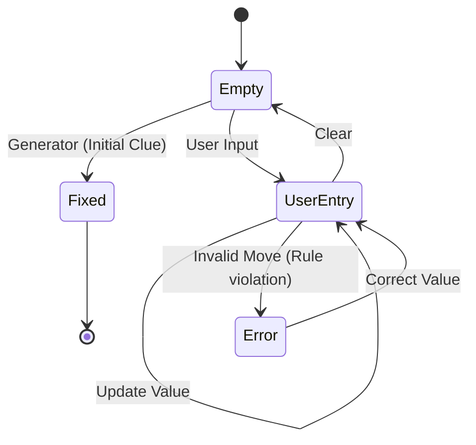

# Technical Documentation - Sudoku Elite
## Industrial Architecture & UML Vivo

This document provides a deep dive into the architectural design of Sudoku Elite, adhering to the requirements of "Entornos de Desarrollo".

### 1. Class Diagram (Mermaid)
The following diagram illustrates the relationship between the domain, persistence, and UI layers.

### 2. Sequence Diagram: New Game Generation
How the system reacts when a user requests a new game.

### 3. State Diagram: Board Logic
States of a single cell in the Sudoku grid.

### 4. Technical Stack Summary
- **Language**: Java 17
- **Architecture**: MVC (Model-View-Controller) / DAO Pattern
- **Persistence**: MySQL 8.0 with HikariCP Pooling
- **Testing**: JUnit 5 + JaCoCo (Quality Gate 50-80%)
- **CI/CD**: GitHub Actions (Build, Test, Javadoc, Coverage)
